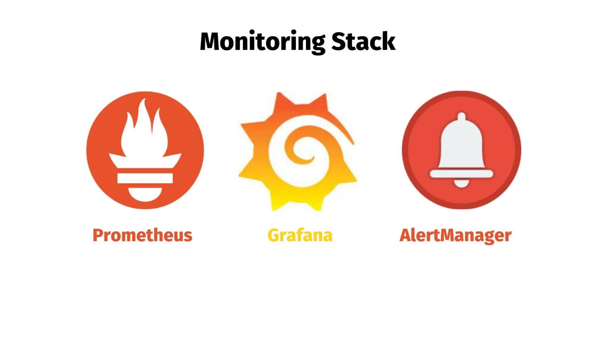
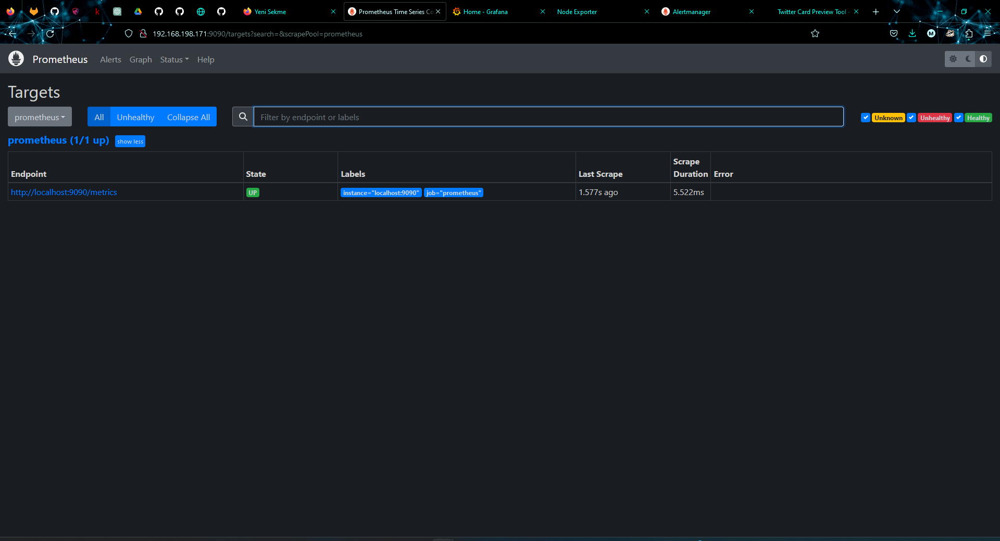
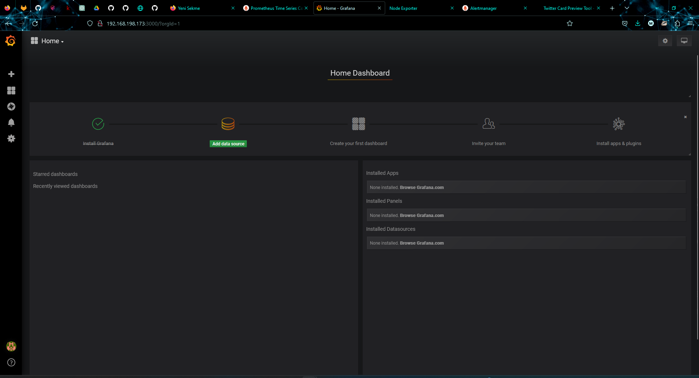
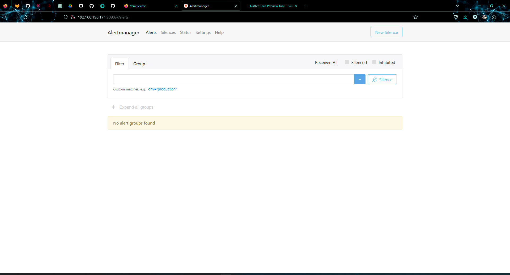
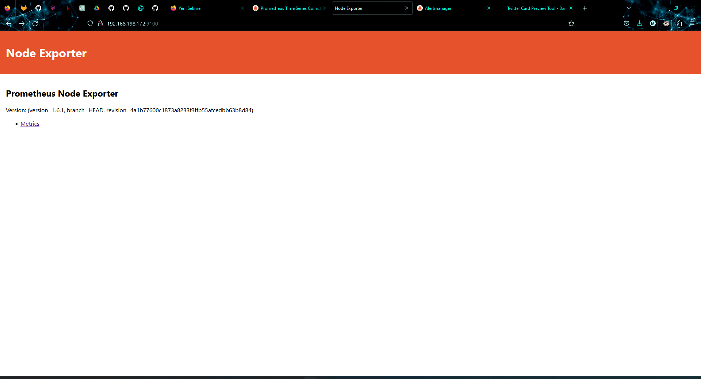

Setup Monitoring Systems with Ansible Automation
=========

### Prometheus, Alertmanager, Grafana, Node Exporter

Requirements
------------

Minimum 2 or 3 managed nodes(in my case CentOS7) and 1 Ansible Control node

Installing this collection
------------

You can install the ansible.posix collection with the Ansible Galaxy CLI:

    ansible-galaxy collection install ansible.posix

You can also download a `requirements.yml` file and install it with:

    ansible-galaxy collection install -r requirements.yml

Example Playbook
----------------

After changing ansible.cfg and inventory files, Run setup-monitoring-systems.yml file to start the Setup of the Monitoring Systems

    ansible-playbook setup-monitoring-systems.yml

Images from Project
-------

### Prometheus

---
### Grafana

---
### Alert Manager

---
### Node Exporter

License
-------

GNU General Public License v3.0

Author Information
------------------

[LinkedIn](https://www.linkedin.com/in/imannovv/)

